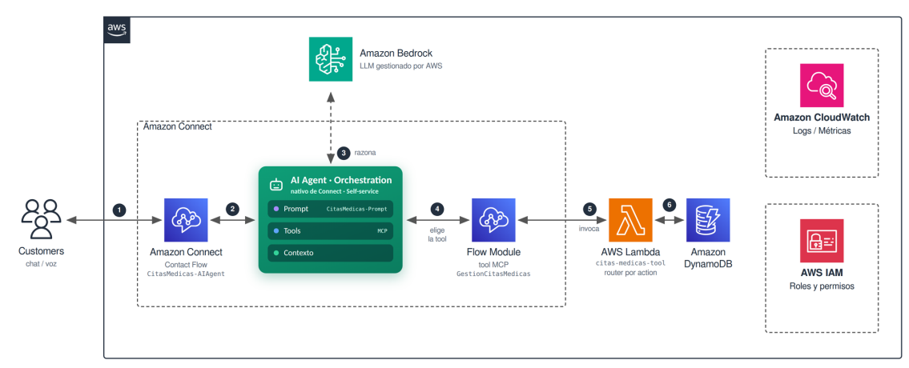

# Citas Médicas - AI Agent + Amazon Connect

Asistente conversacional para la gestión de citas médicas mediante **chat en Amazon Connect**. Permite consultar disponibilidad, agendar, consultar, reagendar y cancelar citas utilizando lenguaje natural.

El proyecto utiliza un **AI Agent de Amazon Q in Connect** para gestionar la conversación y el razonamiento, mientras que **AWS Lambda + DynamoDB** ejecutan las operaciones relacionadas con las citas.

---

## 1. ¿Qué es este proyecto?

Este proyecto muestra cómo construir un asistente conversacional para gestionar citas médicas utilizando servicios serverless de AWS.

La arquitectura combina:

* **Amazon Connect** para la experiencia conversacional.
* **Amazon Lex V2** como puente hacia el AI Agent.
* **Amazon Q in Connect** para el razonamiento del agente.
* **Flow Module** como herramienta (Tool) del agente.
* **AWS Lambda** para ejecutar las operaciones.
* **DynamoDB** como base de datos.

El proyecto también nació como una comparación entre un bot tradicional basado en **Amazon Lex V2 + intents/slots** y una arquitectura basada en **AI Agents + Tools**.

---

## 2. Arquitectura



```text
Usuario
   │
   ▼
Chat
   │
   ▼
Contact Flow
(Amazon Connect)
   │
   ▼
Bot Lex "Puente"
(sin intents, solo reenvía)
   │
   ▼
AI Agent
(Amazon Q in Connect)
   │
   │ Razonamiento + decisión
   ▼
Tool
(Flow Module)
   │
   ▼
AWS Lambda
   │
   ▼
Repository Pattern
   │
   ▼
DynamoDB
```

El AI Agent decide qué necesita hacer y cuándo utilizar la herramienta. El backend ejecuta las reglas de negocio y devuelve el resultado al agente.

---

## 3. Empezar desde cero

### ¿Es tu primera vez con este proyecto?

Si acabas de clonar el repositorio y quieres reproducir la solución completa, sigue este orden:

### Paso 1. Preparar y desplegar el Backend

Primero configura Python, ejecuta las pruebas y despliega:

**[→ Guía de Despliegue del Backend](docs/deploy-backend.md)**

Esta guía cubre:

* Preparación del entorno Python.
* Pruebas unitarias.
* Validación y construcción con AWS SAM.
* Despliegue de Lambda, DynamoDB e IAM.
* Carga de las especialidades.
* Verificación del Lambda desplegado.

### Paso 2. Configurar Amazon Connect y el AI Agent

Una vez desplegado el backend, continúa con:

**[→ Guía de Configuración de Amazon Connect](docs/amazon-connect-setup.md)**

Esta guía explica, en orden, cómo configurar:

1. Dominio de Amazon Q in Connect.
2. Flow Module que funciona como Tool.
3. Permisos del Security Profile.
4. AI Agent de tipo Orchestration.
5. Prompt y reglas del agente.
6. Publicación del AI Agent.
7. Bot puente de Amazon Lex.
8. Contact Flow principal.

> **Importante:** el backend debe estar desplegado antes de configurar la Tool, porque necesitas el ARN de la función Lambda.

### Paso 3. Configurar el comportamiento del agente

Las reglas de conversación y las acciones que puede ejecutar el agente están documentadas aquí:

**[→ Prompt y reglas del AI Agent](docs/prompt-agente.md)**

### Paso 4. Si encuentras algún problema

Consulta:

**[→ Troubleshooting y limitaciones conocidas](docs/troubleshooting.md)**

---

## 4. Quickstart del Backend

### ¿Ya conoces el proyecto y solo quieres levantar el backend?

Si ya sabes cómo funciona la arquitectura y solo necesitas preparar o desplegar el backend, puedes utilizar este flujo rápido.

### Clonar el repositorio

```powershell
git clone <URL_DEL_REPOSITORIO>

cd citas-medicas-ai-agent
```

### Crear el entorno virtual

```powershell
python -m venv .venv

.venv\Scripts\Activate.ps1
```

### Instalar dependencias

```powershell
pip install -r requirements.txt
```

### Ejecutar pruebas

```powershell
pytest tests/ -v
```

Actualmente el proyecto cuenta con **28 pruebas unitarias**.

### Validar y construir

```powershell
sam validate

sam build
```

### Primer despliegue

```powershell
sam deploy --guided
```

### Siguientes despliegues

Después de completar la configuración inicial:

```powershell
sam deploy
```

### Cargar datos iniciales

```powershell
python scripts/seed_especialidades.py
```

> Para conocer el proceso completo de despliegue, incluyendo la configuración de AWS, verificación del stack y pruebas del Lambda, consulta [`docs/deploy-backend.md`](docs/deploy-backend.md).

---

## 5. Estructura del Proyecto

El código está separado en capas para mantener aisladas la entrada desde Amazon Connect, la lógica de negocio y el acceso a datos.

```text
citas-medicas-ai-agent/

├── template.yaml                 # Infraestructura como código (SAM)
│
├── src/
│   ├── lambda_function.py        # Router de entrada
│   ├── channel_adapter.py        # Adaptador del formato de Connect
│   ├── repository.py             # Operaciones DynamoDB
│   ├── utils.py                  # Utilidades y normalización
│   └── handlers/                 # Reglas de negocio
│
├── tests/                        # Pruebas unitarias
│
├── events/                       # Eventos utilizados para pruebas
│
├── scripts/
│   └── seed_especialidades.py    # Carga inicial de especialidades
│
└── docs/
    ├── deploy-backend.md         # Despliegue del backend
    ├── amazon-connect-setup.md   # Configuración de Connect
    ├── prompt-agente.md          # Prompt y reglas del agente
    └── troubleshooting.md        # Problemas y limitaciones
```

---

## 6. Resultado de las Pruebas

Las pruebas se ejecutan **100% en memoria**, sin consumir servicios reales de AWS.

| Módulo             | Descripción                                        | Pruebas | Resultado       |
| ------------------ | -------------------------------------------------- | ------: | --------------- |
| `test_handlers.py` | Lógica de agendar, consultar, cancelar y reagendar |      13 | PASSED          |
| `test_utils.py`    | Normalización de datos y extracción de códigos     |      15 | PASSED          |
| **Total**          | **Cobertura de las reglas de negocio**             |  **28** | **100% PASSED** |

Ejecutar:

```powershell
pytest tests/ -v
```

---

## 7. Datos de Prueba

Este proyecto utiliza **datos ficticios** para demostración y pruebas.

No utilizar información real de pacientes ni datos personales

Las credenciales de AWS tampoco deben almacenarse dentro del repositorio.
