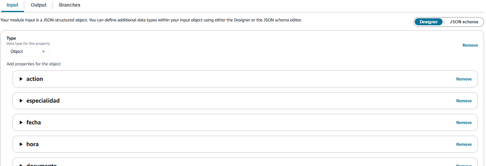
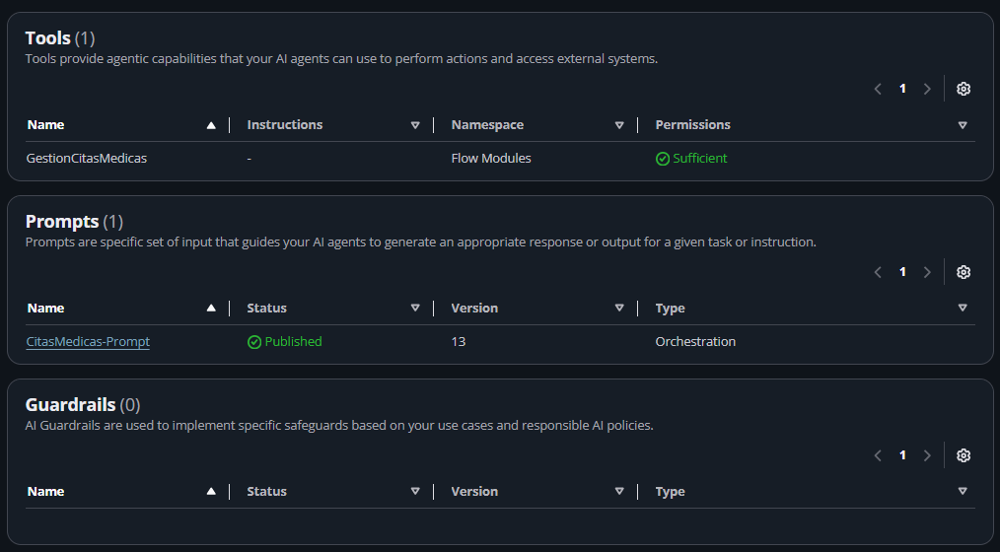

# Configuración en la Consola de Amazon Connect

Dado que la integración entre Amazon Connect, Lex v2 y Amazon Q in Connect tiene soporte limitado en CloudFormation/SAM, estos pasos deben realizarse manualmente desde la consola web de AWS.

---

## 1. Dominio de Amazon Q in Connect

<!-- IMAGEN: Pantalla de AI Agents mostrando el Dominio de Amazon Q in Connect -->

1. En la consola de Amazon Connect, navega en el menú lateral izquierdo hacia **Applications → AI Agents**.
2. Confirma que en la sección **Domains** aparezca el dominio configurado (ejemplo: `DominioCitasMedicas`).
3. Si aún no existe un dominio, créalo seleccionando la integración correspondiente o desde la consola del servicio **Amazon Q in Connect**.

---

## 2. Flow Module (Tool `GestionCitasMedicas`)

Este módulo funciona como la herramienta (Tool) del AI Agent para conectar la conversación con la función Lambda.

<!-- IMAGEN 1: Coloca aquí la captura del diagrama del Flow Module -->

1. Ve a **Flows → Modules → Add flow module**.
2. Nómbralo **`GestionCitasMedicas`**.
3. Configura el **Input Schema** (Settings → Input, tipo Object):
   - `action` (String, **Requerido**)
   - `especialidad`, `fecha`, `hora`, `documento`, `paciente`, `codigo_cita` (Strings, opcionales).

   <!-- IMAGEN 2: Coloca aquí la captura que muestra la lista de campos del Input Schema -->
   

4. **Diseño del Módulo:**
   - Bloque `Set logging behavior` (Enabled).
   - Bloque `AWS Lambda function`: Selecciona la función Lambda desplegada.
   - Tanto la rama **Success** como **Error** deben finalizar en bloques **`Return`** *(No usar `MessageParticipant`, para que el resultado regrese al AI Agent)*.
5. Guarda y selecciona **Save → Save as tool**.

---

## 3. Permisos de Perfil de Seguridad

1. Ve a **Users → Security profiles → Admin** (o el perfil asignado).
2. Navega a **Channels and Flows → Flow modules**.
3. Asigna permiso de **Access** sobre la tool `GestionCitasMedicas`.
4. Haz clic en **Save** *(De lo contrario la tool mostrará el estado `Insufficient` en lugar de `Sufficient`)*.

---

## 4. Configuración del AI Agent (Orchestration)

<!-- IMAGEN 3: Coloca aquí la captura con el resumen general del AI Agent y Guardrails (0) -->

1. Ve a **Amazon Q in Connect → AI Agents → Create AI Agent**.
2. **Agent Type:** Selecciona **Orchestration**.
3. **Tools:** Agrega la tool `GestionCitasMedicas` (`Add tool → Add existing AI Tool`), además de las herramientas base (`Complete` y `Escalate`). *Mantén desactivado `User Confirmation` en la tool*.
4. **Prompt:** Configura el System Prompt base y añade las reglas de negocio (ver detalles en [`docs/prompt-agente.md`](prompt-agente.md)).
5. **Guardrails:** Actualmente no se utilizan Guardrails de Bedrock (`Guardrails: 0`); el control de seguridad y reglas de negocio se gestiona desde el Prompt y la lógica del Lambda.
6. Haz clic en **Save** y luego **Publish**.
7. **Copia el AI Agent ARN:**
   - **Para Pruebas / PoC:** Puedes usar el ARN terminado en `:$SAVED` (ejemplo: `...:ai-agent/...:$SAVED`), lo que te permite probar cambios en tiempo real sin publicar una nueva versión en cada ajuste.
   - **Para Producción:** Es recomendable publicar el agente y usar el ARN que termina en el número de versión (ejemplo: `...:ai-agent/...:1`) para asegurar estabilidad.

---

## 5. Bot Puente de Amazon Lex v2

<!-- IMAGEN 4: Coloca aquí la captura del Bot de Lex mostrando el switch del AI Agent activado -->

1. Ve a **Flows → Conversational AI → Create bot** (ej. `Bot_CitasMedicas_Orchestration`).
2. Idioma: **Spanish (US)**.
3. En la configuración del idioma, activa el switch **"Amazon Connect AI agent intent"**.
4. *Nota:* Este bot no requiere intents ni slots manuales, actúa únicamente como canal puente hacia el AI Agent.
5. Haz clic en **Build language** o **Build**.

---

## 6. Contact Flow Principal

<!-- IMAGEN 5: Coloca aquí la captura del flujo de bloques completo (Connect assistant, Get customer input, etc.) -->

1. Ve a **Flows → Create flow** y conecta los bloques en la siguiente secuencia:

| # | Bloque | Configuración |
|---|---|---|
| 1 | **Set logging behavior** | Enabled |
| 2 | **Set voice** | Spanish (US) (Ej. Pedro) |
| 3 | **Connect assistant** | Selecciona el Dominio de Q in Connect |
| 4 | **Get customer input** | Selecciona el Bot de Lex (`Bot_CitasMedicas_Orchestration`). Agrega el **Session Attribute** manual: - Key: `x-amz-lex:q-in-connect:ai-agent-arn` - Value: *ARN publicado del AI Agent* |
| 5 | **Disconnect** | Finalización de la llamada/chat |

2. **Save** y **Publish**.

---

[← Volver al README principal](../README.md)
