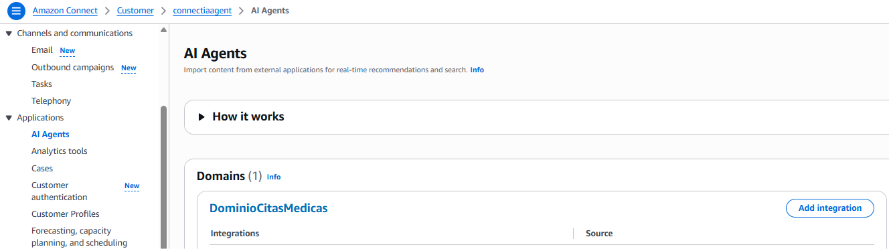
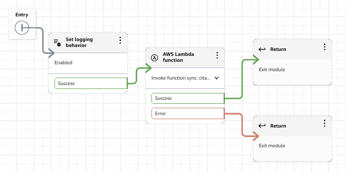
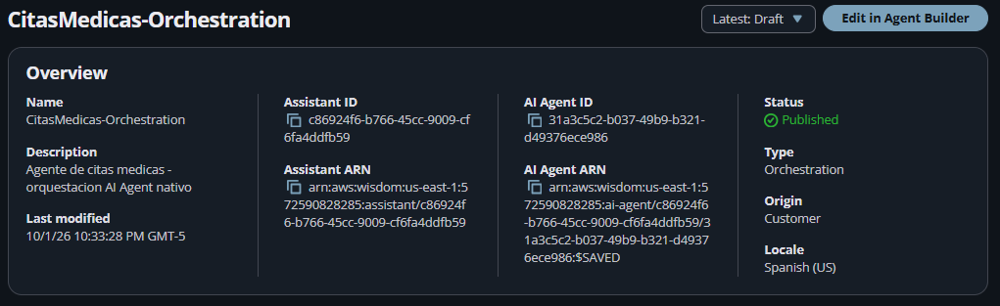
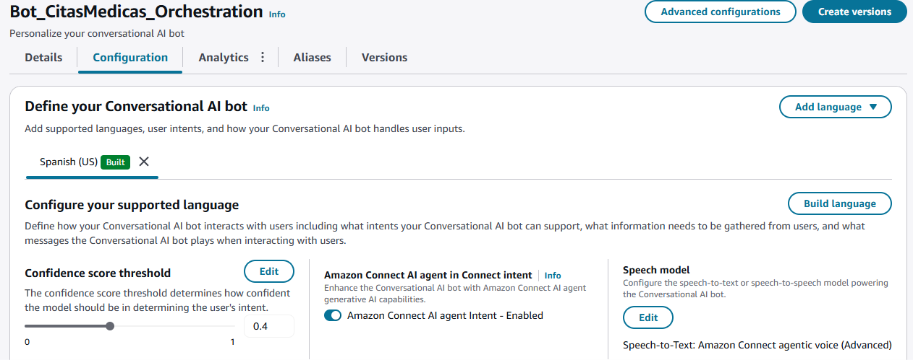
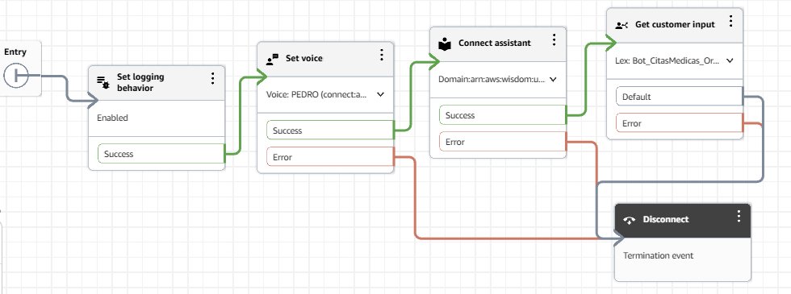

# Configuración en la Consola de Amazon Connect

Dado que la integración entre Amazon Connect, Lex v2 y Amazon Q in Connect tiene soporte limitado en CloudFormation/SAM, estos pasos deben realizarse manualmente desde la consola web de AWS.

---

## 1. Dominio de Amazon Q in Connect

<!-- Pendiente: captura de la pantalla de AI Agents mostrando el Dominio -->

1. En la consola de Amazon Connect, navega en el menú lateral izquierdo hacia **Applications → AI Agents**.
2. Confirma que en la sección **Domains** aparezca el dominio configurado (ejemplo: `DominioCitasMedicas`).
3. Si aún no existe un dominio, créalo seleccionando la integración correspondiente o desde la consola del servicio **Amazon Q in Connect**.

---

## 2. Flow Module (Tool `CitasMedicasTool`)

Este módulo funciona como la herramienta (Tool) del AI Agent para conectar la conversación con la función Lambda.

Aquí es donde se invoca el Lambda de este repo. La rama de la izquierda del módulo (`AWS Lambda function`) debe terminar en bloques **`Return`** en ambas ramas (Success/Error) — eso es lo que permite que el resultado regrese al AI Agent en vez de hablarle directo al cliente:

1. Ve a **Flows → Modules → Add flow module**.
2. Nómbralo **`CitasMedicasTool`**.
3. Configura el **Input Schema** (Settings → Input, tipo Object):
   - `action` (String, **Requerido**)
   - `especialidad`, `fecha`, `hora`, `documento`, `paciente`, `codigo_cita` (Strings, opcionales).
4. **Diseño del Módulo:**
   - Bloque `Set logging behavior` (Enabled).
   - Bloque `AWS Lambda function`: Selecciona la función Lambda desplegada (`citas-medicas-ai-agent`).
   - Tanto la rama **Success** como **Error** deben finalizar en bloques **`Return`** *(No usar `MessageParticipant`, para que el resultado regrese al AI Agent)*.
5. En **Description** del módulo, documenta las 5 acciones, sus parámetros y los formatos obligatorios (ver `prompt-agente.md`) — el LLM lee este texto para decidir cómo invocar la tool.
6. Guarda y selecciona **Save → Save as tool**.

---

## 3. Permisos de Perfil de Seguridad

1. Ve a **Users → Security profiles → Admin** (o el perfil asignado).
2. Navega a **Channels and Flows → Flow modules**.
3. Asigna permiso de **Access** sobre la tool `CitasMedicasTool`.
4. Haz clic en **Save** *(De lo contrario la tool mostrará el estado `Insufficient` en lugar de `Sufficient`)*. Si tras guardar sigue en `Insufficient`, recarga la página del agente (`Ctrl+F5`) o quita y vuelve a agregar la tool.

---

## 4. Configuración del AI Agent (Orchestration)

<!-- Pendiente: captura del resumen general del AI Agent -->

1. Ve a **Amazon Q in Connect → AI Agents → Create AI Agent**.
2. **Agent Type:** Selecciona **Orchestration** — es el único tipo compatible con el bloque nativo `Get customer input` (Self Service no lo soporta).
3. **Tools:** Agrega la tool `CitasMedicasTool` (`Add tool → Add existing AI Tool`), además de las herramientas base (`Complete` y `Escalate`). Mantén **desactivado** `User Confirmation` en la tool — la confirmación se maneja por prompt, no por este switch, porque la tool mezcla acciones de lectura y escritura.
4. **Prompt:** Configura el System Prompt base y añade las reglas de negocio (ver detalles en [`prompt-agente.md`](prompt-agente.md)).
5. Haz clic en **Save** y luego **Publish**.
6. **Copia el AI Agent ARN:**
   - **Para pruebas rápidas en consola:** puede usarse el ARN terminado en `:$SAVED`, que refleja el último guardado sin necesidad de publicar en cada ajuste.
   - **Para el flujo de producción/demo:** usa el ARN que termina en el número de versión publicada (ejemplo: `...:ai-agent/...:1`) — es el que da estabilidad, ya que `:$SAVED` puede seguir cambiando mientras edites el agente.

---

## 5. Bot Puente de Amazon Lex v2

<!-- Pendiente: captura del Bot de Lex mostrando el switch del AI Agent activado -->

1. Ve a **Flows → Conversational AI → Create bot** (ej. `Bot_CitasMedicas_Puente`).
2. Idioma: **Spanish (US)**.
3. En la configuración del idioma, activa el switch **"Amazon Connect AI agent intent"**.
4. *Nota:* Este bot no requiere intents ni slots manuales, actúa únicamente como canal puente hacia el AI Agent.
5. Haz clic en **Build**.

---

## 6. Contact Flow Principal

<!-- Pendiente: captura del flujo de bloques completo -->

Ve a **Flows → Create flow** y conecta los bloques en la siguiente secuencia:

| # | Bloque | Configuración |
|---|---|---|
| 1 | **Set logging behavior** | Enabled |
| 2 | **Set voice** | Spanish (US) (ej. Pedro o Fernanda) |
| 3 | **Connect assistant** | Selecciona el Dominio de Q in Connect (paso 1) |
| 4 | **Get customer input** | Selecciona el Bot de Lex (`Bot_CitasMedicas_Puente`, paso 5). Agrega el **Session Attribute** manual: Key `x-amz-lex:q-in-connect:ai-agent-arn`, Value = ARN publicado del AI Agent (paso 4) |
| 5 | **(opcional) Set working queue → Transfer to queue** | Para derivar a un agente humano |
| 6 | **Disconnect** | Finalización de todos los caminos de error/fin |

**Save** y **Publish**.

---

[← Volver al README principal](../README.md)